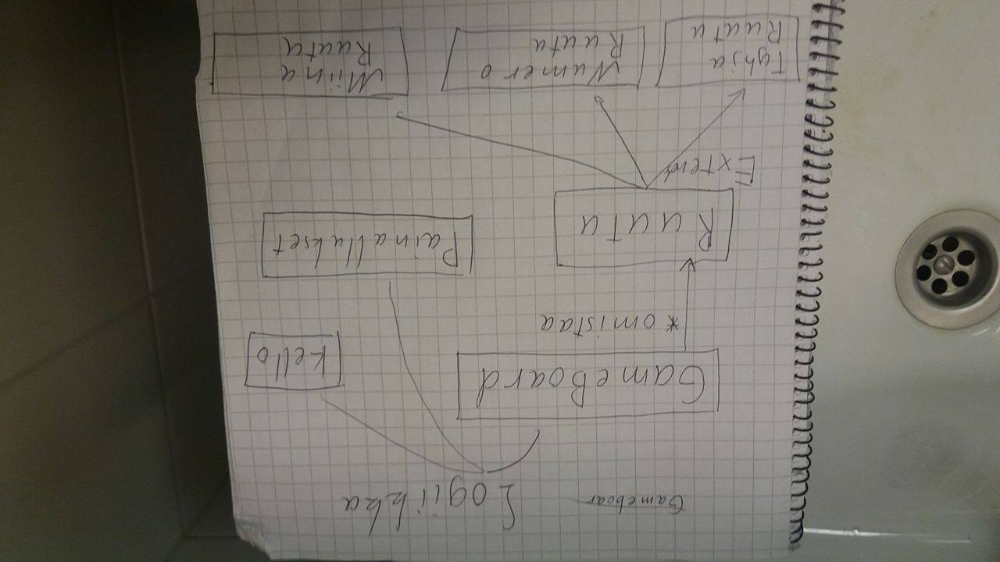

Se ei suostu menemään oikein päin... Tuossa naapurifilessä kun aukaisee pdf:llä niin minulla ainakin näkyy oikeinpäin se..

Tarkennus luokkakaavioon

Viimeinen tarkennus luokkakaavioon.

Kaikilla luokilla on yhteys toisiinsa. Esimerkiksi RuutuButton voisi halutessaan kutsua siihen yhdistetyn Ruudun kautta GameBoardia, joka kutsuu Logiikkaa, joka kutsuu MinesweperUIta.

Tämähän ei millään tavalla ole hyvien käytäntöjen mukaista. Käytännössä kuitenkin huomasin että tämä oli helpoin toteuttaa ohjelma työkaluilla, jotka olen tähän mennessä saanut.

Uuden pelin sekvenssikaavio

Pelatun pelin sekvenssikaavio
